# Assignment: Carbon Emission Calculator

## Overview
In this assignment, you will develop a Java application that calculates and tracks the carbon emissions of various activities. The application will use PostgreSQL for data storage and JDBC for database interaction. This project aims to familiarize you with database operations, JDBC, and the integration of Java applications with databases.

## Objectives
- Understand and apply CRUD operations in PostgreSQL.
- Use JDBC for database connectivity in a Java application.
- Design and implement a database schema for a real-world application.
- Practice using SQL features like joins, subqueries, custom enum types, and aggregate functions.

## Project Setup

### Setting Up the Database Environment
- Install PostgreSQL and set up a new database named `carbon_emission`.
- Ensure that your PostgreSQL server is running and accessible.

### Creating Tables and Relationships
You will need to create tables for `Activities`, `Emission_Factors`, and `User_Emissions`. Make sure to define primary keys and foreign keys appropriately.

### Creating Model Classes
Create Java classes that represent the entities in your database: `model.Activity`, `model.EmissionFactor`, and `model.UserEmission`.

### Creating DAO Interfaces
Define DAO interfaces for each model class, specifying methods for CRUD operations and any additional queries you find necessary.

### Creating DAO Implementations Classes
Implement the DAO interfaces using JDBC to perform the actual database operations.

### Creating util.ConnectionFactory Class
Implement a `util.ConnectionFactory` class to manage database connections. This class should use the Singleton pattern to ensure only one instance of the connection is used throughout the application.

### Creating SqlQueries.java enum classes
- Create an enum `util.CRUDQueries` for storing your CRUD operation queries.
- Create an enum `util.OperationQueries` for storing additional SQL operation queries, including joins, subqueries, and aggregate functions.

### Creating Main Class as Demo using Scanner
Implement a main class that demonstrates the functionality of your application. Use a `Scanner` to interact with the user, allowing them to calculate and track their carbon emissions.

## SQL Operations
Ensure your application supports the following operations:
- Inserting, updating, and deleting records in the database.
- Calculating total emissions for a user.
- Comparing emissions between different activities.
- Listing activities with emissions above a certain threshold.

## Class Diagram includes all required classes with their relationships
### Java Classes Diagram# Assignment: Carbon Emission Calculator

## Overview
In this assignment, you will develop a Java application that calculates and tracks the carbon emissions of various activities. The application will use PostgreSQL for data storage and JDBC for database interaction. This project aims to familiarize you with database operations, JDBC, and the integration of Java applications with databases.

## Objectives
- Understand and apply CRUD operations in PostgreSQL.
- Use JDBC for database connectivity in a Java application.
- Design and implement a database schema for a real-world application.
- Practice using SQL features like joins, subqueries, custom enum types, and aggregate functions.

## Project Setup

### Setting Up the Database Environment
- Install PostgreSQL and set up a new database named `carbon_emission`.
- Ensure that your PostgreSQL server is running and accessible.

### Creating Tables and Relationships
You will need to create tables for `Activities`, `Emission_Factors`, and `User_Emissions`. Make sure to define primary keys and foreign keys appropriately.

### Creating Model Classes
Create Java classes that represent the entities in your database: `model.Activity`, `model.EmissionFactor`, and `model.UserEmission`.

### Creating DAO Interfaces
Define DAO interfaces for each model class, specifying methods for CRUD operations and any additional queries you find necessary.

### Creating DAO Implementations Classes
Implement the DAO interfaces using JDBC to perform the actual database operations.

### Creating util.ConnectionFactory Class
Implement a `util.ConnectionFactory` class to manage database connections. This class should use the Singleton pattern to ensure only one instance of the connection is used throughout the application.

### Creating SqlQueries.java enum classes
- Create an enum `util.CRUDQueries` for storing your CRUD operation queries.
- Create an enum `util.OperationQueries` for storing additional SQL operation queries, including joins, subqueries, and aggregate functions.

### Creating Main Class as Demo using Scanner
Implement a main class that demonstrates the functionality of your application. Use a `Scanner` to interact with the user, allowing them to calculate and track their carbon emissions.

## SQL Operations
Ensure your application supports the following operations:
- Inserting, updating, and deleting records in the database.
- Calculating total emissions for a user.
- Comparing emissions between different activities.
- Listing activities with emissions above a certain threshold.

## Class Diagram includes all required classes with their relationships
### Java Classes Diagram

#### Model Classes

| Class Name     | Attributes                                                                 | Relationships |
|----------------|----------------------------------------------------------------------------|---------------|
| model.User           | userId: Long<br>username: String<br>email: String                          |               |
| model.Activity       | activityId: Long<br>name: String<br>description: String                    |               |
| model.EmissionFactor | factorId: Long<br>activityId: Long<br>factor: Double<br>unit: String       |               |
| model.UserEmission   | emissionId: Long<br>userId: Long<br>activityId: Long<br>quantity: Double<br>emission: Double<br>date: LocalDate |               |
| model.EmissionGoal   | goalId: Long<br>userId: Long<br>targetEmission: Double<br>startDate: LocalDate<br>endDate: LocalDate<br>status: String |               |

#### DAO Interfaces and Implementations

| Interface       | Implementation |
|-----------------|----------------|
| UserDAO         | UserDAOImpl    |
| ActivityDAO     | ActivityDAOImpl|
| EmissionFactorDAO | EmissionFactorDAOImpl |
| UserEmissionDAO | UserEmissionDAOImpl   |
| EmissionGoalDAO | EmissionGoalDAOImpl   |

#### Additional Classes

| Class Name        | Description |
|-------------------|-------------|
| util.ConnectionFactory | Manages the database connection, ensuring the use of a single connection instance throughout the application. |
| SqlQueries Enums  | Two enums (`util.CRUDQueries` and `util.OperationQueries`) to organize SQL queries for CRUD operations and additional SQL operations, respectively. |
| Main Class        | The entry point of the application, which uses a `Scanner` to interact with the user, demonstrating the application's functionality. |

#### Optional Service Classes

| Service Class            | Description |
|--------------------------|-------------|
| UserService              |             |
| ActivityService          |             |
| EmissionCalculationService |             |

## Tables Diagram includes all required Tables with their relationships
### Database Schema Tables

#### Users Table

| Column Name    | Data Type | Constraints     |
|----------------|-----------|-----------------|
| user_id        | INT       | PRIMARY KEY     |
| username       | VARCHAR   |                 |
| email          | VARCHAR   |                 |
| password_hash  | VARCHAR   |                 |

#### Activities Table

| Column Name    | Data Type | Constraints     |
|----------------|-----------|-----------------|
| activity_id    | INT       | PRIMARY KEY     |
| name           | VARCHAR   |                 |
| description    | TEXT      |                 |

#### Emission_Factors Table

| Column Name    | Data Type | Constraints                  |
|----------------|-----------|------------------------------|
| factor_id      | INT       | PRIMARY KEY                  |
| activity_id    | INT       | FOREIGN KEY (Activities)     |
| factor         | DECIMAL   |                              |
| unit           | VARCHAR   |                              |

#### User_Emissions Table

| Column Name    | Data Type | Constraints                  |
|----------------|-----------|------------------------------|
| emission_id    | INT       | PRIMARY KEY                  |
| user_id        | INT       | FOREIGN KEY (Users)          |
| activity_id    | INT       | FOREIGN KEY (Activities)     |
| quantity       | DECIMAL   |                              |
| emission       | DECIMAL   |                              |
| date           | DATE      |                              |

#### Emission_Goals Table

| Column Name    | Data Type | Constraints              |
|----------------|-----------|--------------------------|
| goal_id        | INT       | PRIMARY KEY              |
| user_id        | INT       | FOREIGN KEY (Users)      |
| target_emission| DECIMAL   |                          |
| start_date     | DATE      |                          |
| end_date       | DATE      |                          |
| status         | VARCHAR   |                          |

### Database Schema


### Relationships Overview Diagram

```plaintext
[Users] 1----* [User_Emissions] *----1 [Activities]
  |                                      |
  |                                      |
  *                                      *
[Emission_Goals]                        [Emission_Factors]
```

## Tasks
1. Set up the PostgreSQL environment and create the required tables.
2. Implement model classes in Java.
3. Define and implement DAO interfaces.
4. Implement the `util.ConnectionFactory` class.
5. Populate `util.CRUDQueries` and `util.OperationQueries` enums with necessary SQL queries.
6. Implement CRUD operations in DAO classes.
7. ### SQL Operation
Implement SQL operations for calculating and comparing emissions:
  a. **Calculate Total Emissions for a model.User**
   - Use a `JOIN` between `User_Emissions` and `Users`.
   - Aggregate emissions using `SUM`.
   - Group results by user.

  b. **Compare Emissions Between Different Activities**
   - Use a `JOIN` between `User_Emissions` and `Activities`.
   - Calculate the average emission per activity using `AVG`.
   - Group results by activity and order by average emission.

  c. **List Activities with Emissions Above a Certain Threshold**
   - Use a `JOIN` between `User_Emissions` and `Activities`.
   - Filter results where emission is greater than a specified threshold.

  d. **Calculate Monthly Emissions for a model.User**
   - Extract month from emission date.
   - Aggregate emissions using `SUM` for each month.
   - Group results by month.

  e. **Find Users Who Have Exceeded Their Emission Goals**
   - Use a `JOIN` between `Users` and `Emission_Goals`.
   - Include a subquery to calculate total emissions for each user.
   - Filter users whose total emissions exceed their target emission.

  f. **Using Custom Enum Types in Queries**
   - Assume a custom enum type for a column (e.g., `status` in `Emission_Goals`).
   - Filter results based on the enum value (e.g., `status = 'ACHIEVED'`).

  g. **Aggregate Emissions by model.Activity Type and Filter by Minimum Emission**
   - Use a `JOIN` between `User_Emissions` and `Activities`.
   - Group results by activity.
   - Use `HAVING` to filter groups by a minimum total emission.

  h. **Identify Top 3 Activities with the Highest Average Emissions**
   - Use a `JOIN` between `User_Emissions` and `Activities`.
   - Calculate the average emission per activity.
   - Group results by activity and order by average emission.
   - Limit results to the top 3 activities.
8. Develop a CLI-based Main Class for model.User Interaction

## Implementation
Follow the project setup instructions to implement the application. Ensure that your code is clean, well-documented, and follows best practices for database interaction and Java development.

## Bonus Task
- Implement a feature to visualize the user's carbon emissions over time using a simple chart or graph.

## Notes
- Pay attention to SQL injection vulnerabilities. Use prepared statements where applicable.
- Ensure your application handles database connections and exceptions gracefully.

## Submission
Submit your project via GitHub Classroom. Ensure your repository is well-organized, with clear instructions on how to set up and run your application. Include any necessary SQL scripts for setting up the database.


#### Model Classes

| Class Name     | Attributes                                                                 | Relationships |
|----------------|----------------------------------------------------------------------------|---------------|
| model.User           | userId: Long<br>username: String<br>email: String                          |               |
| model.Activity       | activityId: Long<br>name: String<br>description: String                    |               |
| model.EmissionFactor | factorId: Long<br>activityId: Long<br>factor: Double<br>unit: String       |               |
| model.UserEmission   | emissionId: Long<br>userId: Long<br>activityId: Long<br>quantity: Double<br>emission: Double<br>date: LocalDate |               |
| model.EmissionGoal   | goalId: Long<br>userId: Long<br>targetEmission: Double<br>startDate: LocalDate<br>endDate: LocalDate<br>status: String |               |

#### DAO Interfaces and Implementations

| Interface       | Implementation |
|-----------------|----------------|
| UserDAO         | UserDAOImpl    |
| ActivityDAO     | ActivityDAOImpl|
| EmissionFactorDAO | EmissionFactorDAOImpl |
| UserEmissionDAO | UserEmissionDAOImpl   |
| EmissionGoalDAO | EmissionGoalDAOImpl   |

#### Additional Classes

| Class Name        | Description |
|-------------------|-------------|
| util.ConnectionFactory | Manages the database connection, ensuring the use of a single connection instance throughout the application. |
| SqlQueries Enums  | Two enums (`util.CRUDQueries` and `util.OperationQueries`) to organize SQL queries for CRUD operations and additional SQL operations, respectively. |
| Main Class        | The entry point of the application, which uses a `Scanner` to interact with the user, demonstrating the application's functionality. |

#### Optional Service Classes

| Service Class            | Description |
|--------------------------|-------------|
| UserService              |             |
| ActivityService          |             |
| EmissionCalculationService |             |

## Tables Diagram includes all required Tables with their relationships
### Database Schema Tables

#### Users Table

| Column Name    | Data Type | Constraints     |
|----------------|-----------|-----------------|
| user_id        | INT       | PRIMARY KEY     |
| username       | VARCHAR   |                 |
| email          | VARCHAR   |                 |
| password_hash  | VARCHAR   |                 |

#### Activities Table

| Column Name    | Data Type | Constraints     |
|----------------|-----------|-----------------|
| activity_id    | INT       | PRIMARY KEY     |
| name           | VARCHAR   |                 |
| description    | TEXT      |                 |

#### Emission_Factors Table

| Column Name    | Data Type | Constraints                  |
|----------------|-----------|------------------------------|
| factor_id      | INT       | PRIMARY KEY                  |
| activity_id    | INT       | FOREIGN KEY (Activities)     |
| factor         | DECIMAL   |                              |
| unit           | VARCHAR   |                              |

#### User_Emissions Table

| Column Name    | Data Type | Constraints                  |
|----------------|-----------|------------------------------|
| emission_id    | INT       | PRIMARY KEY                  |
| user_id        | INT       | FOREIGN KEY (Users)          |
| activity_id    | INT       | FOREIGN KEY (Activities)     |
| quantity       | DECIMAL   |                              |
| emission       | DECIMAL   |                              |
| date           | DATE      |                              |

#### Emission_Goals Table

| Column Name    | Data Type | Constraints              |
|----------------|-----------|--------------------------|
| goal_id        | INT       | PRIMARY KEY              |
| user_id        | INT       | FOREIGN KEY (Users)      |
| target_emission| DECIMAL   |                          |
| start_date     | DATE      |                          |
| end_date       | DATE      |                          |
| status         | VARCHAR   |                          |

### Database Schema


### Relationships Overview Diagram

```plaintext
[Users] 1----* [User_Emissions] *----1 [Activities]
  |                                      |
  |                                      |
  *                                      *
[Emission_Goals]                        [Emission_Factors]
```

## Tasks
1. Set up the PostgreSQL environment and create the required tables.
2. Implement model classes in Java.
3. Define and implement DAO interfaces.
4. Implement the `util.ConnectionFactory` class.
5. Populate `util.CRUDQueries` and `util.OperationQueries` enums with necessary SQL queries.
6. Implement CRUD operations in DAO classes.
7. ### SQL Operation
Implement SQL operations for calculating and comparing emissions:
a. **Calculate Total Emissions for a model.User**
- Use a `JOIN` between `User_Emissions` and `Users`.
- Aggregate emissions using `SUM`.
- Group results by user.

b. **Compare Emissions Between Different Activities**
- Use a `JOIN` between `User_Emissions` and `Activities`.
- Calculate the average emission per activity using `AVG`.
- Group results by activity and order by average emission.

c. **List Activities with Emissions Above a Certain Threshold**
- Use a `JOIN` between `User_Emissions` and `Activities`.
- Filter results where emission is greater than a specified threshold.

d. **Calculate Monthly Emissions for a model.User**
- Extract month from emission date.
- Aggregate emissions using `SUM` for each month.
- Group results by month.

e. **Find Users Who Have Exceeded Their Emission Goals**
- Use a `JOIN` between `Users` and `Emission_Goals`.
- Include a subquery to calculate total emissions for each user.
- Filter users whose total emissions exceed their target emission.

f. **Using Custom Enum Types in Queries**
- Assume a custom enum type for a column (e.g., `status` in `Emission_Goals`).
- Filter results based on the enum value (e.g., `status = 'ACHIEVED'`).

g. **Aggregate Emissions by model.Activity Type and Filter by Minimum Emission**
- Use a `JOIN` between `User_Emissions` and `Activities`.
- Group results by activity.
- Use `HAVING` to filter groups by a minimum total emission.

h. **Identify Top 3 Activities with the Highest Average Emissions**
- Use a `JOIN` between `User_Emissions` and `Activities`.
- Calculate the average emission per activity.
- Group results by activity and order by average emission.
- Limit results to the top 3 activities.
8. Develop a CLI-based Main Class for model.User Interaction

## Implementation
Follow the project setup instructions to implement the application. Ensure that your code is clean, well-documented, and follows best practices for database interaction and Java development.

## Bonus Task
- Implement a feature to visualize the user's carbon emissions over time using a simple chart or graph.

## Notes
- Pay attention to SQL injection vulnerabilities. Use prepared statements where applicable.
- Ensure your application handles database connections and exceptions gracefully.

## Submission
Submit your project via GitHub Classroom. Ensure your repository is well-organized, with clear instructions on how to set up and run your application. Include any necessary SQL scripts for setting up the database.


----
#### From here written by me:

# CARBON-EMISSION-CALCULATOR
## Database instruction

### Setting Up the Database Environment
- Install PostgreSQL and set up a new database named `carbon_emission`.
- these command on terminal
`sudo -u postgres psql` -- Access PostgreSQL shell
`CREATE DATABASE carbon_emission;` -- Create database
`\c carbon_emission` -- Connect to database

- Project Structure on IntelliJ to connect to the database
  - Check if JDK is set up 
  - Import JDBC driver for PostgreSQL from project libraries
  - Select PostgreSQL from `Data Source` and configure the database
  - Test if the connection is successful
- Ensure that your PostgreSQL server is running and accessible.
### Tables and inserted data

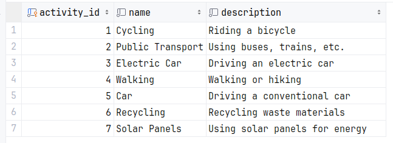

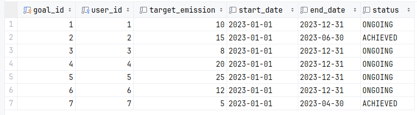

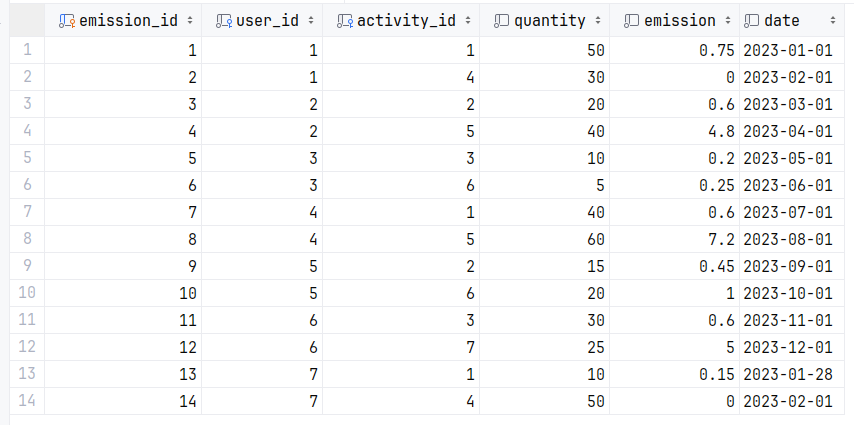

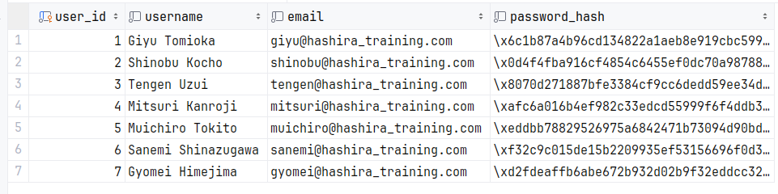

## Run the application

 - Create the new activity

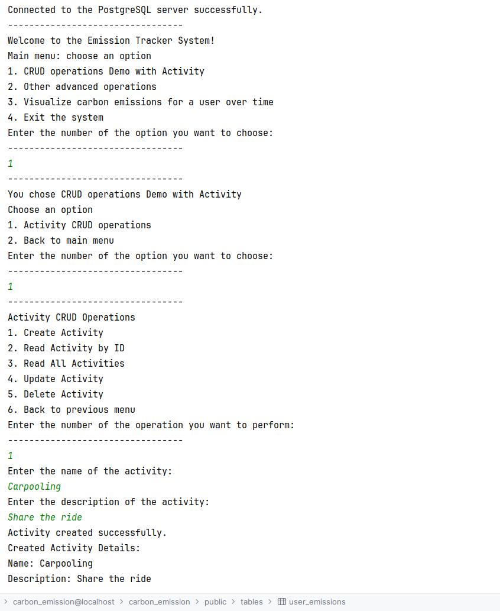

 - Created data in the table

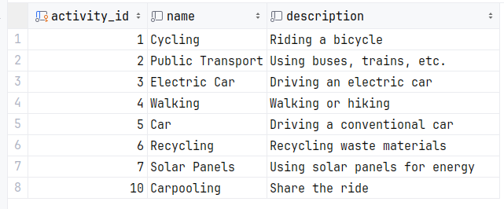

 - Read the activity by id and all the activities

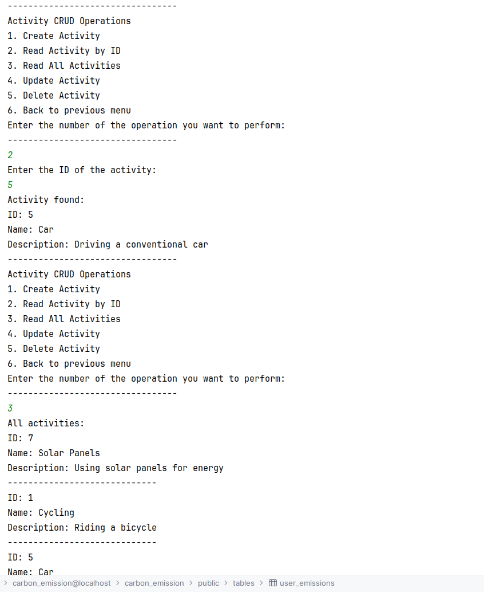

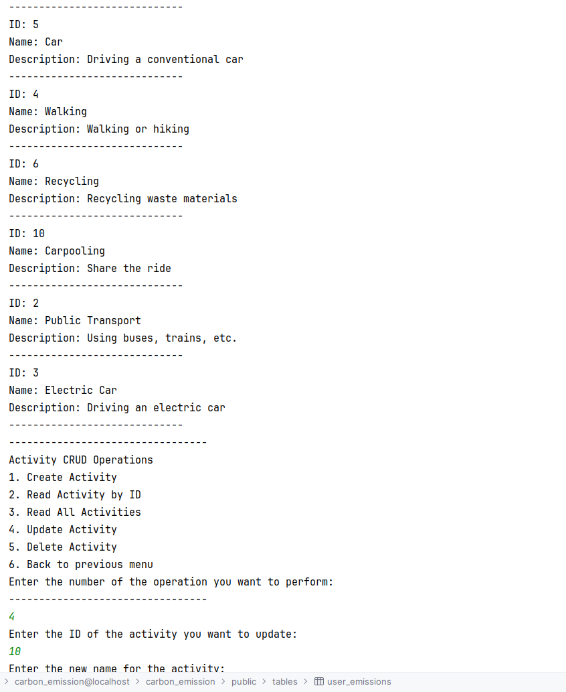

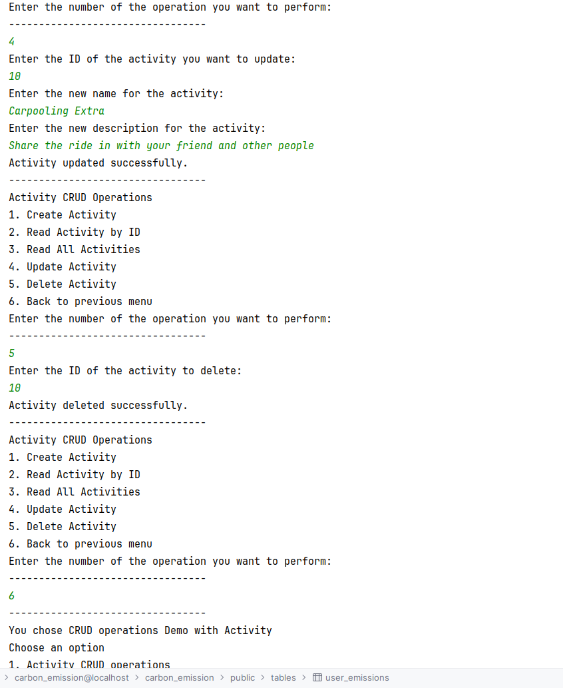

 - Updated information for the Carpooling on the table

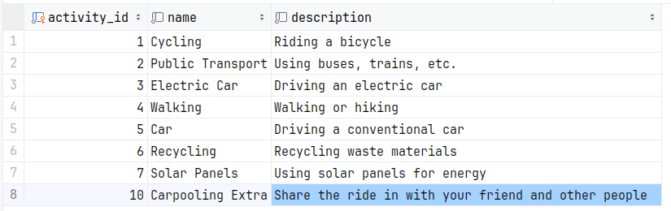

 - Id 10 is deleted from the table

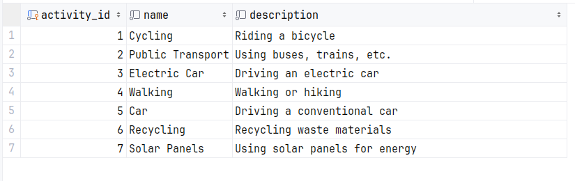

 - Going back to main menu and choose the other operations

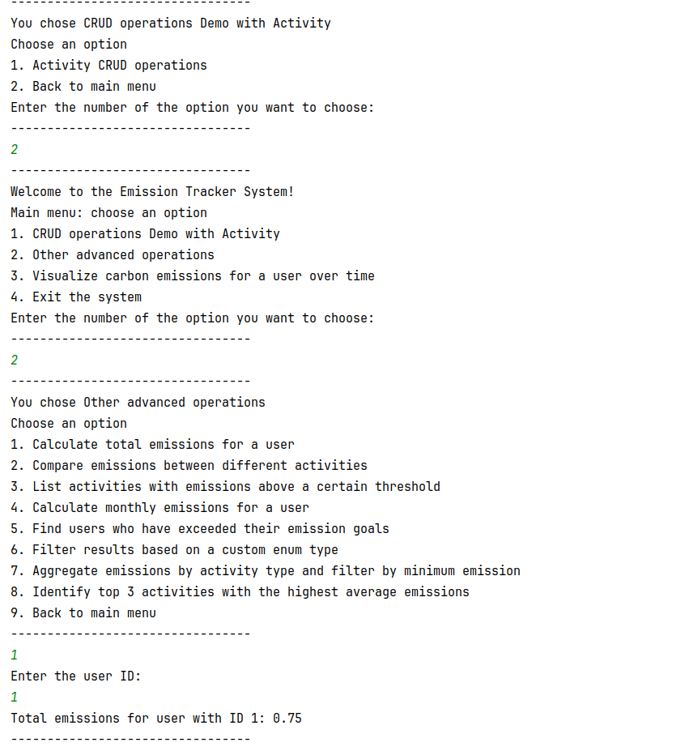

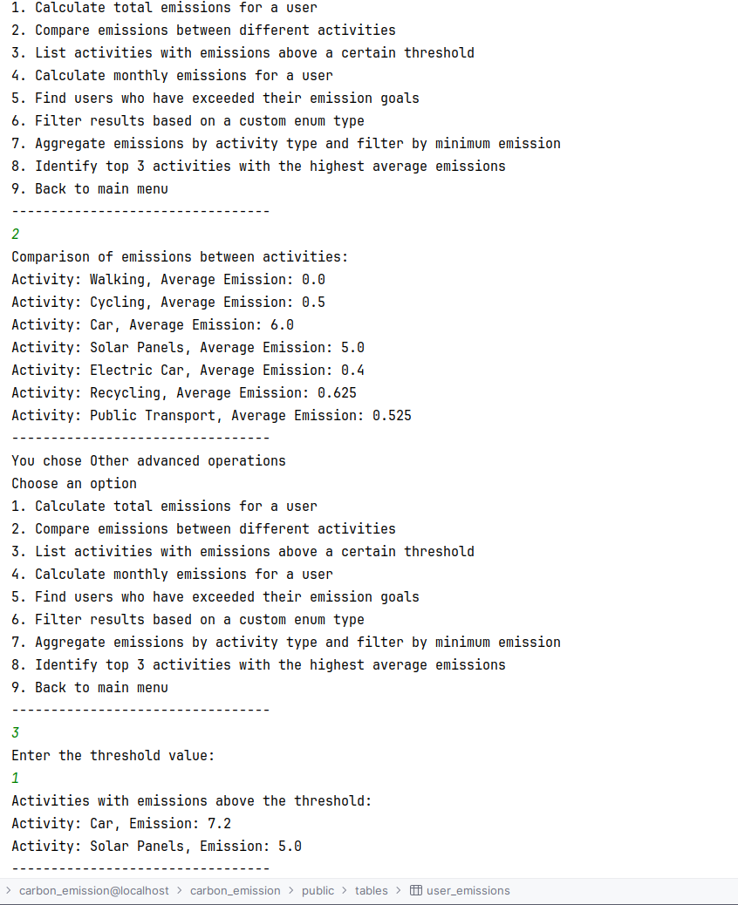

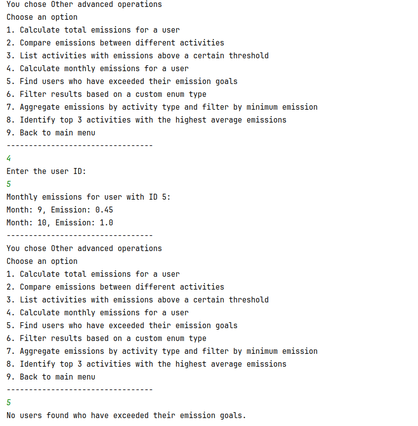

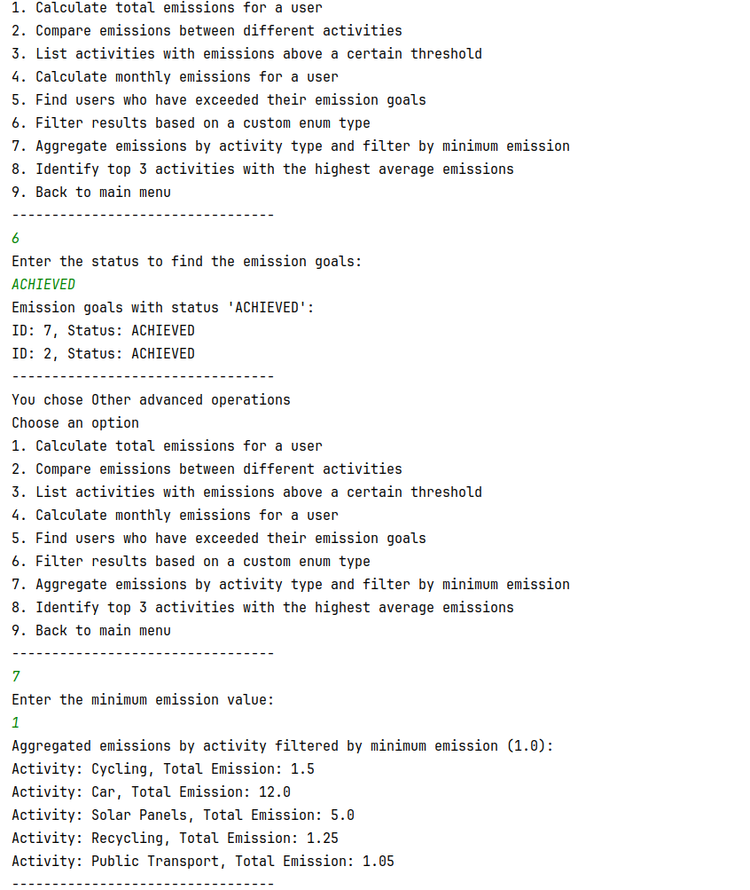

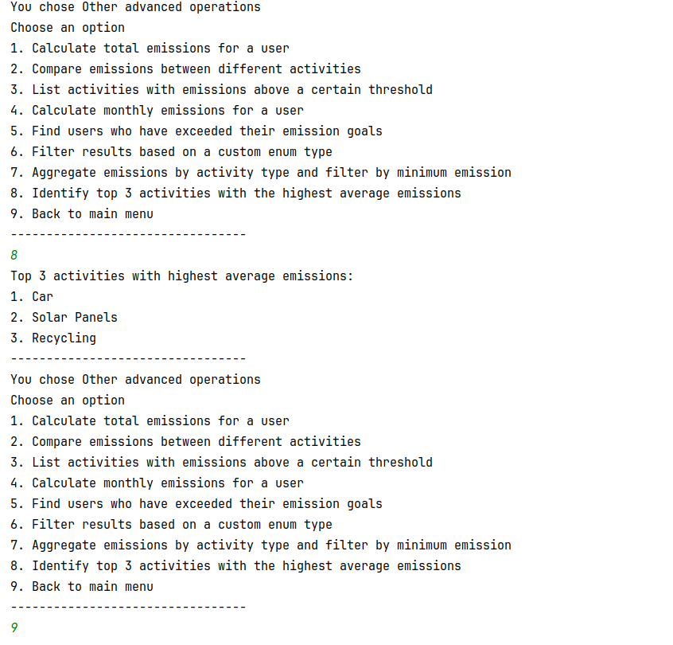

 - Visualize the user's carbon emissions over time using a simple chart or graph

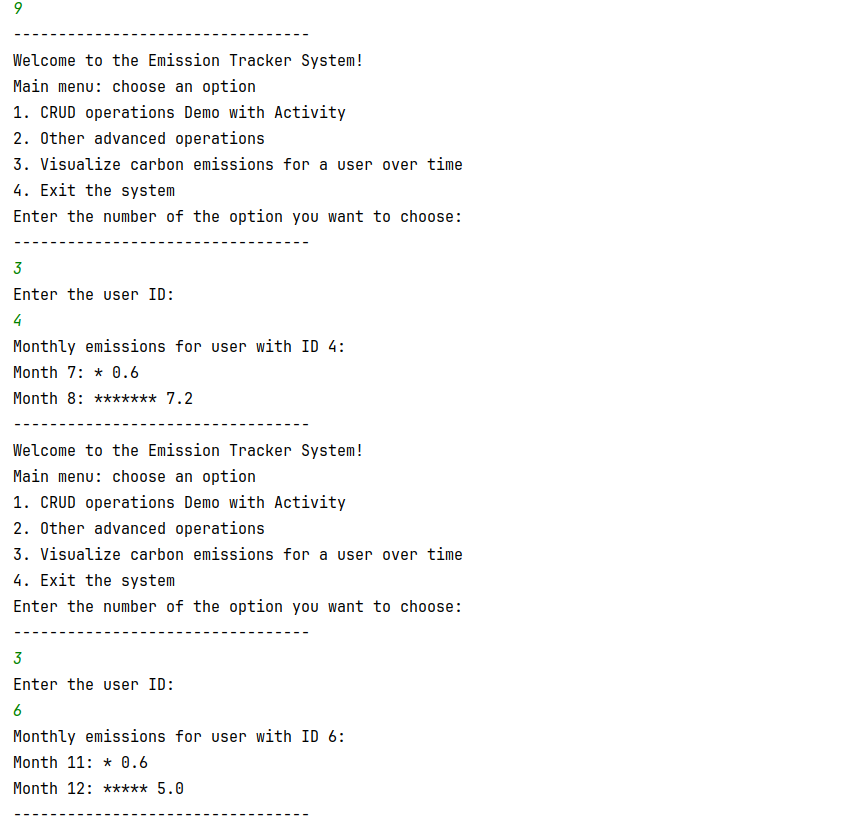

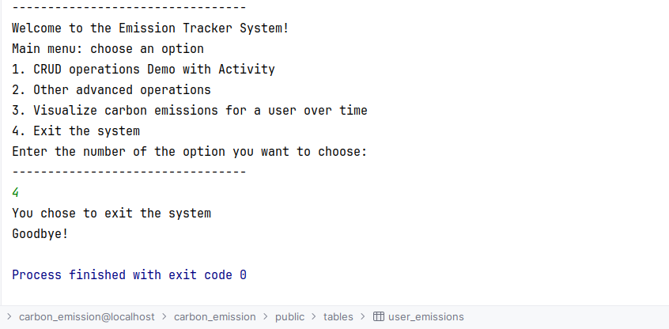

### Run the test methods

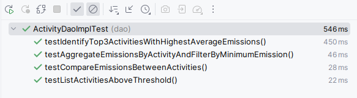

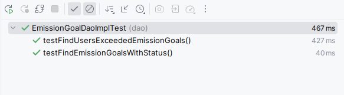

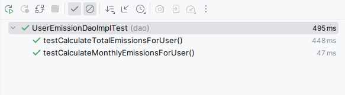